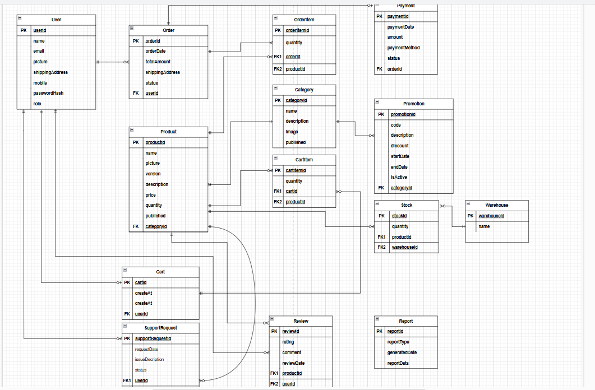
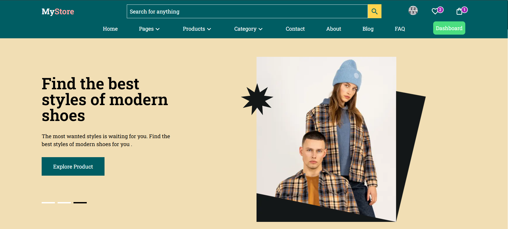
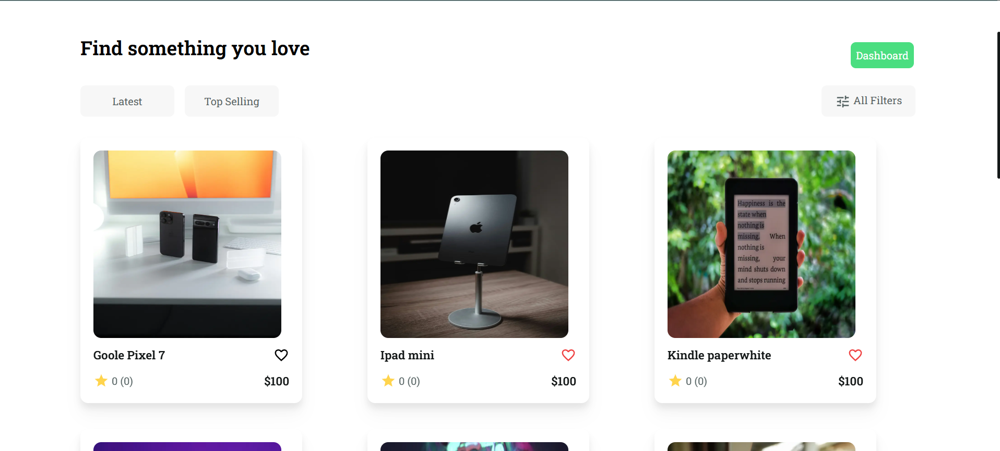
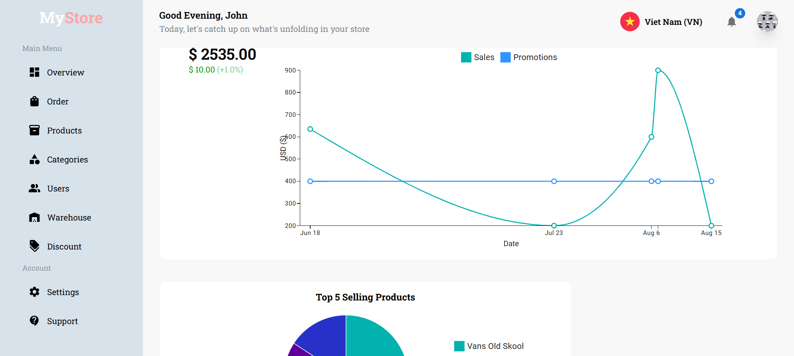

<<<<<<< HEAD
# 🛍️ My Store E-commerce Platform

My Store is a modern, scalable e-commerce platform built with **Next.js**. Designed to deliver a seamless shopping experience, it integrates powerful technologies like **Prisma**, **Redux**, **Firebase**, and **MUI**, providing a feature-rich and responsive application.

---

## ✨ Features

### 🔐 Authentication

-   Secure user login and registration powered by **Clerk**.

### 🗃️ Database Management

-   Utilizes **Prisma ORM** for efficient and type-safe database access.

### 📊 Analytics & Charts

-   Visualize sales and user data using **MUI Charts** and **X-Data-Grid**.

---

## 🛠️ Tech Stack

### 💻 Frontend

-   **React** – Component-based UI
-   **Next.js** – SSR & SSG framework
-   **Tailwind CSS** – Utility-first CSS
-   **MUI** – Component library for consistent design

### 🧠 Backend & Services

-   **Prisma** – Type-safe ORM for DB access
-   **Firebase** – Notifications & real-time sync
-   **Nodemailer** – Email sending service

### 📦 State Management

-   **Redux Toolkit** – Centralized state management
-   **Redux Persist** – Persist Redux state between sessions

### 🧰 Development Tools

-   **TypeScript** – Type safety
-   **Vercel** – Deployment platform

---

## 🧭 Entity Relationship Diagram (ERD)


---

## 🚀 Getting Started

### 1. Clone the Repository
=======

# My Store E-commerce Platform
## Introduce
My Store is a modern e-commerce platform built with Next.js, designed to provide a seamless online shopping experience. The project leverages cutting-edge technologies like Prisma, Redux, Firebase, and MUI to deliver a scalable, responsive, and feature-rich application.

>>>>>>> e04029033e8fba1ab891217c4e003e1daef74cdf


## Features
### Authentications
- User authentication and management using **Clerk**.

### Database Management:
- Powered by **Prisma ORM** for efficient database interactions.

### State Management:
- Global state management using **Redux Toolkit** and **Redux Persist** for session persistence.

### Real-Time Features:
- Real-time updates and notifications with Firebase.

### UI Design:
- Intuitive and responsive design using MUI (Material-UI) and TailwindCSS.

### Email Notifications:
- Transactional and user notifications via **Nodemailer**.

### Charts and Analytics:
- Display sales and user data using MUI Charts and X-Data-Grid.


## Technologies Used


**Frontend**:
- React: Component-based architecture for dynamic user interfaces.
- Next.js: Framework for server-side rendering and static site generation.
- TailwindCSS: Utility-first CSS framework for styling.
- MUI: Pre-designed components for consistent UI.
**Backend**:
- Prisma: ORM for database interactions.
- Firebase: For notifications and real-time updates.
- Nodemailer: For email notifications.
**State Management**:
- Redux Toolkit: For state management.
- Redux Persist: For persisting the state across sessions.
**Development Tools**:
- Typescript: For type safety and better development experience.
- Vercel: For deploying the application.

## Installation

### 1. Clone the repository:
```bash
<<<<<<< HEAD
git clone https://github.com/PhucHau0310/My-Store.git
cd my-store
```

### 2. Install Dependencies

```bash
npm install
```

### 3. Setup Environment Variables

```bash
DATABASE_URL=your-database-url
NEXT_PUBLIC_FIREBASE_API_KEY=your-firebase-api-key
NEXT_PUBLIC_CLERK_FRONTEND_API=your-clerk-frontend-api
CLERK_API_KEY=your-clerk-backend-api-key
```

### 4. Setup the Database

```bash
npx prisma generate
npx prisma migrate deploy
```

## 🚀 Deployment

This project is optimized for deployment on Vercel.
Ensure that all required environment variables are properly set in your Vercel project settings.

## 📸 Screenshots

### 🏠 Homepage


### 🛒 Product Listing


### 📊 Admin Dashboard


## 📬 Contact

-   Name: Nguyễn Phúc Hậu

-   Email: haunhpr024@gmail.com

-   GitHub: PhucHau0310
=======
  git clone https://github.com/your-username/my-store.git  
  cd my-store  
```

### 2. Install dependencies:
```bash
  npm Install 
```

### 3. Set up environment variables:
Create a .env file and add the following variables:
```bash
  DATABASE_URL=your-database-url  
  NEXT_PUBLIC_FIREBASE_API_KEY=your-firebase-api-key  
  NEXT_PUBLIC_CLERK_FRONTEND_API=your-clerk-frontend-api  
  CLERK_API_KEY=your-clerk-backend-api-key  
```

### 4. Set up the database:
```bash
  npx prisma generate  
  npx prisma migrate deploy  
```

### 5. Run the development:
```bash
  npm run dev  
```

### 6. Build for production:
```bash
  npm run build
```

## Deployment
This project is optimized for deployment on Vercel. Ensure the environment variables are properly configured in the Vercel dashboard before deployment.


## Screenshots








## Contact

- Name: Nguyễn Phúc Hậu
- Email: haunhpr024@gmail.com

>>>>>>> e04029033e8fba1ab891217c4e003e1daef74cdf
